# Report — Customer Personality Analysis Model

- **Goal (classification):** `Response` (predict whether a customer accepts the next marketing campaign).
- **Goal (regression):** `Income` (predict a customer's yearly household income).

**Metrics.**
- Classification: BCE loss + accuracy, precision, recall, **F1** (main), ROC-AUC (threshold 0.5).
- Regression: MSE, **RMSE** (main), MAE, R².

## 1st Version (BASELINE)

- `classification_pytorch.ipynb`
- `classification_scratch.ipynb`
- `regression_pytorch.ipynb`
- `regression_scratch.ipynb`
- `weights/*`
- All four share one deliberately simple architecture: single hidden layer, `Linear → ReLU → Linear(→1)`, He init, Adam(lr=1e-3), 50 epochs, batch 64, seed 42.

### Classification

- **Architecture used.**
  - Shallow MLP (torch `ClfMLP` + mirror NumPy `ScratchMLP`)
  - `x(22) → Linear(22→32) → ReLU → Linear(32→1) → logit`

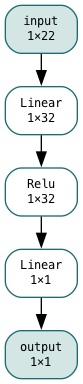

- **Features used.** Voting rule from the EDA (same in both tracks): bivariate `|score| ≥ 0.10` +
  RF top-15 + MI top-15 each cast one vote; 3/3 = chosen, 2/3 = kept here with a named reason each.

  | Feature (votes) | Description (what this feature is) |
  |---|---|
  | `AcceptedCmp5` (3/3) | Whether the customer accepted the offer in the 5th prior campaign (0/1 flag) |
  | `AcceptedCmp3` (3/3) | Whether the customer accepted the offer in the 3rd prior campaign (0/1 flag) |
  | `MntWines` (3/3) | Amount spent on wines over the last 2 years |
  | `MntMeatProducts` (3/3) | Amount spent on meat products over the last 2 years |
  | `NumCatalogPurchases` (3/3) | Number of purchases made through the catalog channel |
  | `Recency` (3/3) | Days since the customer's last purchase |
  | `Customer_Tenure_Days` (3/3) | Days since enrollment, derived from `Dt_Customer` relative to 2014-06-29 |
  | `MntGoldProds` (3/3) | Amount spent on gold products over the last 2 years |
  | `Income` (3/3) | Yearly household income; doubles as the other track's target |
  | `MntFruits` (3/3) | Amount spent on fruits over the last 2 years |
  | `AcceptedCmp1` (2/3) | Whether the customer accepted the offer in the 1st prior campaign (0/1 flag) |
  | `AcceptedCmp2` (2/3) | Whether the customer accepted the offer in the 2nd prior campaign (0/1 flag) |
  | `Marital_Status` (2/3) | Marital status, categorical (5 values after cleaning) → one-hot 5 dims |
  | `NumWebPurchases` (2/3) | Number of purchases made through the website |
  | `MntSweetProducts` (2/3) | Amount spent on sweet products over the last 2 years |
  | `MntFishProducts` (2/3) | Amount spent on fish products over the last 2 years |
  | `NumStorePurchases` (2/3) | Number of purchases made in physical stores |
  | `Age` (2/3) | Customer age in 2014, derived as `2014 − Year_Birth` |

- **Training setup.**
  - 80/20 split
  - `random_state=42`
  - stratified on `Response`
  - `Income` NaNs (24 rows) median-filled as a *feature*
  - fill value = train median (51,735)
  - `StandardScaler` train-fit
  - batch 64
  - 50 epochs
  - weighted BCE (`pos_weight = neg/pos ≈ 5.7`)
  - Adam(lr=1e-3, β1=0.9, β2=0.999, eps=1e-8)
  - no data augmentation

- **Results** (test = held-out 20%, n_test=448; loss = unweighted mean BCE, threshold 0.5):

  | Metric | PyTorch | Scratch | absΔ |
  |---|---|---|---|
  | test BCE | 0.3903 | 0.4357 | 0.0454 |
  | accuracy | 0.8036 | 0.7879 | 0.0157 |
  | precision | 0.4087 | 0.3833 | 0.0254 |
  | recall | 0.7015 | 0.6866 | 0.0149 |
  | **F1** | **0.5165** | **0.4920** | **0.0245** |
  | ROC-AUC | 0.8725 | 0.8617 | 0.0108 |

  Training: torch train 1.211→0.539 / val 0.605→0.390, val-F1 0.369→0.516; scratch train 1.542→0.565 /
  val 1.249→0.436, val-F1 0.257→0.492. Curves descend monotonically, no overfitting kink.

  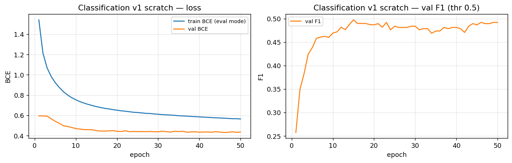

- **Why.** F1 ≈ 0.50 with ROC-AUC ≈ 0.87 is the honest 85/15-imbalance story: accuracy 0.80 beats the
  0.851 all-negative dummy only modestly, while recall 0.70 / precision ~0.40 shows the model actually finds
  responders at the cost of false alarms — exactly why the EDA mandated precision/recall/F1/ROC-AUC over accuracy.
  Prior-campaign flags + spend + recency/tenure carry the ranking, matching the feature list above.
- **What next.** One hidden layer may be the capacity bottleneck (curves never kinked) — try a deeper net next.

### Regression

- **Architecture used.**
  - Shallow MLP (torch `RegMLP` + mirror NumPy twin)
  - `x(13) → Linear(13→32) → ReLU → Linear(32→1) → value`

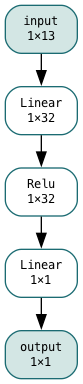

- **Features used.** Same voting rule (bivariate `|r| ≥ 0.10` + RF top-12 + MI top-12; 3/3 chosen, 2/3 with named reason).

  | Feature (votes) | Description (what this feature is) |
  |---|---|
  | `NumCatalogPurchases` (3/3) | Number of purchases made through the catalog channel |
  | `MntMeatProducts` (3/3) | Amount spent on meat products over the last 2 years |
  | `MntWines` (3/3) | Amount spent on wines over the last 2 years |
  | `NumWebVisitsMonth` (3/3) | Number of website visits per month |
  | `MntSweetProducts` (3/3) | Amount spent on sweet products over the last 2 years |
  | `MntFruits` (3/3) | Amount spent on fruits over the last 2 years |
  | `NumWebPurchases` (3/3) | Number of purchases made through the website |
  | `MntGoldProds` (3/3) | Amount spent on gold products over the last 2 years |
  | `NumStorePurchases` (2/3) | Number of purchases made in physical stores |
  | `MntFishProducts` (2/3) | Amount spent on fish products over the last 2 years |
  | `Kidhome` (2/3) | Number of young children in the household |
  | `Age` (2/3) | Customer age in 2014, derived as `2014 − Year_Birth` |
  | `NumDealsPurchases` (2/3) | Number of purchases made with a discount |

- **Training setup.**
  - 80/20 split
  - `random_state=42`
  - 24 missing-`Income` rows dropped
  - target must not be imputed
  - feature scaler train-fit
  - target scaler train-fit
  - z-scored `Income` for training
  - every reported metric inverse-transformed to raw $
  - batch 64
  - 50 epochs
  - mean MSE loss
  - Adam(lr=1e-3, β1=0.9, β2=0.999, eps=1e-8)
  - no data augmentation

- **Results** (test = held-out 20%, n_test=443; metrics in raw $):

  | Metric | PyTorch | Scratch | absΔ / relΔ |
  |---|---|---|---|
  | test MSE (raw) | 125,307,774.9 | 113,761,654.3 | rel 0.092 |
  | **RMSE** | **11,194.1** | **10,665.9** | **rel 0.047** |
  | MAE | 7,170.3 | 6,809.6 | rel 0.050 |
  | **R²** | **0.7287** | **0.7537** | **0.0250** |

  Training (z-space MSE): torch train 1.016→0.464 / val 0.599→0.185, val-RMSE $20,126→$11,194;
  scratch train 0.891→0.456 / val 0.415→0.168, val-RMSE $16,746→$10,666.

  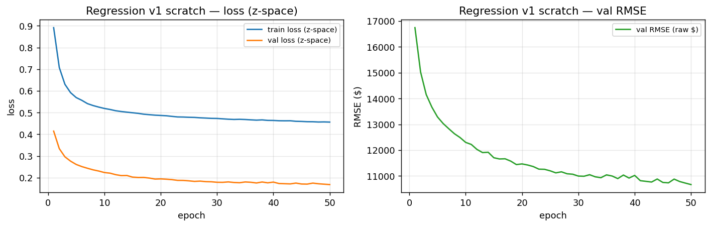

- **Why.** R² ≈ 0.73–0.75 is strong because the EDA said it would be: 17/25 candidates clear 0.10
  bivariately with several > 0.5 — the strongest signal set of all three datasets explored in this project.
  Spend/channel columns are near-mechanical proxies of income. Residual RMSE ≈ $11k against median $51k is the
  multicollinearity price: the top features repeat one affluent-spender signal rather than adding independent drivers.
- **What next.** One hidden layer may be the capacity bottleneck on this track too — try a deeper net;
  also note the $666,666 outlier (≈4× next-highest) inflates squared-error metrics,
  so a log-target or robust loss is a natural follow-up.

## 2nd Version (deeper MLP)

- 2,237-row cleaned data (classification) and 2,213-row dropped-target data (regression)
- 18-column / 13-column feature sets
- 80/20 splits and seed 42
- weighted-BCE and z-space-MSE losses
- Only depth, regularization, and schedule change (100 epochs, cosine annealing, weight decay 1e-4)

- `classification_pytorch_v2.ipynb`, `classification_scratch_v2.ipynb`
- `regression_pytorch_v2.ipynb`, `regression_scratch_v2.ipynb`
- `weights_v2/`
  - `classification_mlp.pt` and `classification_scratch.npz`
  - `regression_mlp.pt` and `regression_scratch.npz`
  - `*_scaler.npz` (feature scalers, target scaler, column order, train median)
  - `*_history.csv` (per-epoch train/val loss + val metric)
  - `*_test_metrics.json` (final test loss + scores)

### Classification

- **Architecture used.**
  - Deep ResNet-style MLP (torch `ClfDeepMLP` + mirror NumPy twin)
  - `x(22) → Linear(22→64) → BN → ReLU → Dropout(0.2) → Linear(64→64) → BN → (+residual) → ReLU → Dropout(0.2) → Linear(64→1) → logit`

- **Training setup.**
  - 80/20 split
  - `random_state=42`
  - stratified on `Response`
  - `Income` NaNs median-filled as a *feature*
  - fill value = train median (51,735)
  - `StandardScaler` train-fit
  - batch 64
  - 100 epochs
  - weighted BCE (`pos_weight ≈ 5.7`)
  - Adam(lr=1e-3) + cosine annealing
  - weight decay 1e-4
  - no data augmentation

- **Results** (n_test=448):

  | Metric | PyTorch | Scratch | absΔ |
  |---|---|---|---|
  | test BCE | 0.3863 | 0.3775 | 0.0088 |
  | accuracy | 0.8214 | 0.8304 | 0.0090 |
  | precision | 0.4454 | 0.4571 | 0.0117 |
  | recall | 0.7910 | 0.7164 | 0.0746 |
  | **F1** | **0.5699** | **0.5581** | **0.0118** |
  | ROC-AUC | 0.8814 | 0.8686 | 0.0128 |

  Curves: torch train 1.055→0.543 / val 0.615→0.386, val-F1 0.425→0.570;
  scratch train 0.642→0.281 / val 0.661→0.378, val-F1 0.366→0.558.

  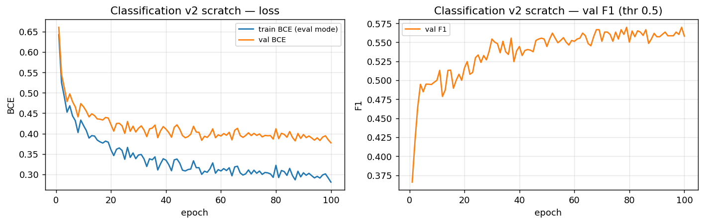

- **Why.** Torch F1 0.5165→0.5699 (+0.053), ROC 0.8725→0.8814; scratch F1 0.4920→0.5581 (+0.066).
  Capacity — not features — was the v1 bottleneck, as suspected (v1 curves never kinked).
  Depth + BN/dropout bought recall without losing precision (torch recall 0.70→0.79, precision 0.41→0.45).
- **What next.** Test whether the 2/3 tier carries real signal — rerun the same deep net on 3/3-only features (v3 ablation).

### Regression

- **Architecture used.**
  - Deep ResNet-style MLP (torch `RegDeepMLP` + mirror NumPy twin)
  - `x(13) → Linear(13→64) → BN → ReLU → Dropout(0.2) → Linear(64→64) → BN → (+residual) → ReLU → Dropout(0.2) → Linear(64→1) → value`

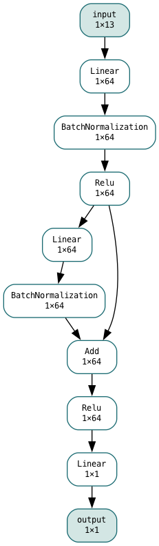

- **Training setup.**
  - 80/20 split
  - `random_state=42`
  - 24 missing-`Income` rows dropped
  - feature scaler train-fit
  - target scaler train-fit
  - z-scored `Income` for training
  - every reported metric inverse-transformed to raw $
  - batch 64
  - 100 epochs
  - z-space MSE loss
  - Adam(lr=1e-3) + cosine annealing
  - weight decay 1e-4
  - no data augmentation

- **Results** (n_test=443, raw $):

  | Metric | PyTorch | Scratch | absΔ / relΔ |
  |---|---|---|---|
  | test MSE | 107,448,373.9 | 118,746,515.5 | rel 0.105 |
  | **RMSE** | **10,365.7** | **10,897.1** | **rel 0.051** |
  | MAE | 6,592.4 | 6,692.6 | rel 0.015 |
  | **R²** | **0.7673** | **0.7429** | **0.0244** |

  Curves (z-MSE): torch train 0.653→0.457 / val 0.394→0.159, val-RMSE $16,324→$10,366;
  scratch train 0.732→0.463 / val 0.469→0.176, val-RMSE $17,815→$10,897.

  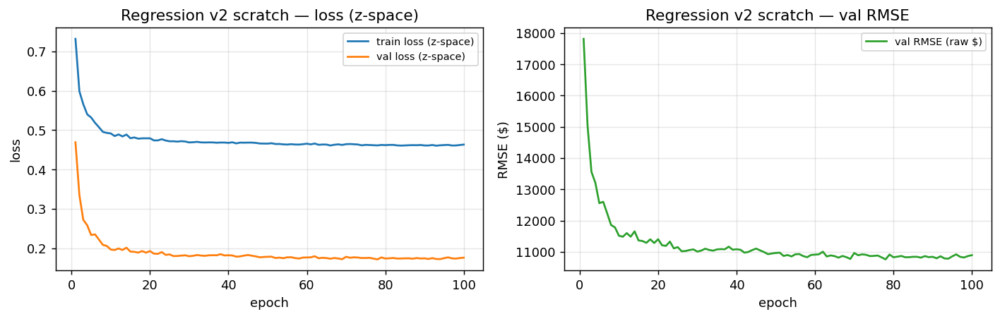

- **Why.** Torch R² 0.7287→0.7673 (+0.039), RMSE $11,194→$10,366 (−7%);
  scratch R² 0.7537→0.7429 (−0.011, init lottery inside tolerance), RMSE $10,666→$10,897.
  Depth helps the oracle clearly; scratch holds roughly at v1 level.
- **What next.** Rerun the classification deep net on 3/3-only features (v3 ablation); LightGBM ceiling and log-target/robust-loss ideas stay open.

## 3rd Version (3/3-only ablation)

- Identical v2 deeper arch, training, splits, and seed
- Only features shrink to 3/3 consensus
- clf 10 cols → 10 dims (one-hot block deleted, params ≈ 5,185)
- reg 8 cols → 8 dims (params ≈ 5,057)

- `classification_pytorch_v3.ipynb`, `classification_scratch_v3.ipynb`
- `regression_pytorch_v3.ipynb`, `regression_scratch_v3.ipynb`
- `weights_v3/`
- Dropped features (3/3-only cut):

  | Dropped (classification, 8) | Description (what this feature is) |
  |---|---|
  | `AcceptedCmp1` | Whether the customer accepted the offer in the 1st prior campaign (0/1 flag) |
  | `AcceptedCmp2` | Whether the customer accepted the offer in the 2nd prior campaign (0/1 flag) |
  | `Marital_Status` | Marital status, categorical (5 values) → one-hot 5 dims |
  | `NumWebPurchases` | Number of purchases made through the website |
  | `MntSweetProducts` | Amount spent on sweet products over the last 2 years |
  | `MntFishProducts` | Amount spent on fish products over the last 2 years |
  | `NumStorePurchases` | Number of purchases made in physical stores |
  | `Age` | Customer age in 2014, derived as `2014 − Year_Birth` |

  | Dropped (regression, 5) | Description (what this feature is) |
  |---|---|
  | `NumStorePurchases` | Number of purchases made in physical stores |
  | `MntFishProducts` | Amount spent on fish products over the last 2 years |
  | `Kidhome` | Number of young children in the household |
  | `Age` | Customer age in 2014, derived as `2014 − Year_Birth` |
  | `NumDealsPurchases` | Number of purchases made with a discount |

### Classification

- **Architecture used.**
  - Deep ResNet-style MLP, 3/3-feature ablation (torch `ClfDeepMLP` + mirror NumPy twin)
  - `x(10) → Linear(10→64) → BN → ReLU → Dropout(0.2) → Linear(64→64) → BN → (+residual) → ReLU → Dropout(0.2) → Linear(64→1) → logit`

- **Training setup.**
  - 80/20 split
  - `random_state=42`
  - stratified on `Response`
  - `Income` NaNs median-filled as a *feature*
  - fill value = train median (51,735)
  - `StandardScaler` train-fit
  - batch 64
  - 100 epochs
  - weighted BCE (`pos_weight ≈ 5.7`)
  - Adam(lr=1e-3) + cosine annealing
  - weight decay 1e-4
  - no data augmentation

- **Results** (n_test=448):

  | Metric | PyTorch | Scratch | absΔ |
  |---|---|---|---|
  | test BCE | 0.4589 | 0.4255 | 0.0334 |
  | accuracy | 0.7388 | 0.7768 | 0.0380 |
  | precision | 0.3377 | 0.3759 | 0.0382 |
  | recall | 0.7761 | 0.7463 | 0.0298 |
  | **F1** | **0.4706** | **0.5000** | **0.0294** |
  | ROC-AUC | 0.8466 | 0.8515 | 0.0049 |

  Curves: torch train 0.711→0.421 / val 0.704→0.459, val-F1 0.410→0.471;
  scratch train 0.690→0.384 / val 0.667→0.425, val-F1 0.425→0.500.

  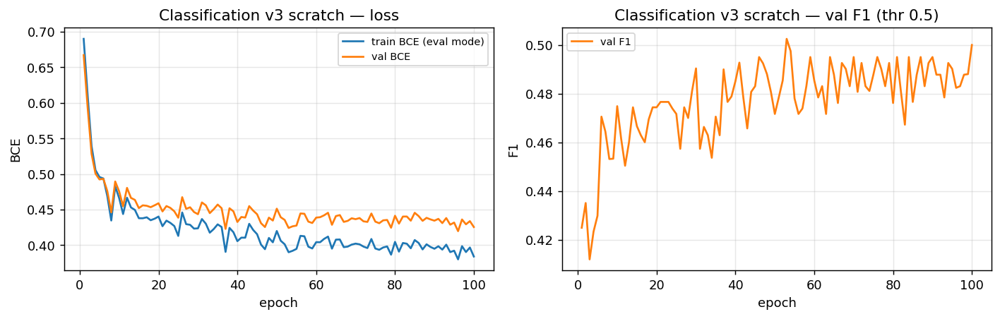

- **Why.** Torch F1 0.5699→0.4706 (**−0.099**), ROC 0.8814→0.8466; scratch F1 0.5581→0.5000 (−0.058).
  Both twins agree: the 2/3 tier carries real, non-redundant signal — most plausibly AcceptedCmp1
  (biv 0.294, the strongest dropped feature) plus the Marital_Status/NumStorePurchases/Age
  non-linear signals the deep net could exploit even though RF demoted them.
- **What next.** The 2/3 tier stays. Next: models from outside the taught list (v4).

### Regression

- **Architecture used.**
  - Deep ResNet-style MLP, 3/3-feature ablation (torch `RegDeepMLP` + mirror NumPy twin)
  - `x(8) → Linear(8→64) → BN → ReLU → Dropout(0.2) → Linear(64→64) → BN → (+residual) → ReLU → Dropout(0.2) → Linear(64→1) → value`

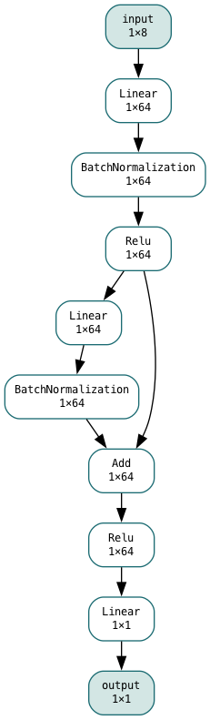

- **Training setup.**
  - 80/20 split
  - `random_state=42`
  - 24 missing-`Income` rows dropped
  - feature scaler train-fit
  - target scaler train-fit
  - z-scored `Income` for training
  - every reported metric inverse-transformed to raw $
  - batch 64
  - 100 epochs
  - z-space MSE loss
  - Adam(lr=1e-3) + cosine annealing
  - weight decay 1e-4
  - no data augmentation

- **Results** (n_test=443, raw $):

  | Metric | PyTorch | Scratch | absΔ / relΔ |
  |---|---|---|---|
  | test MSE | 114,570,589.1 | 116,585,505.8 | rel 0.018 |
  | **RMSE** | **10,703.8** | **10,797.5** | **rel 0.009** |
  | MAE | 6,906.5 | 6,915.9 | rel 0.001 |
  | **R²** | **0.7519** | **0.7476** | **0.0043** |

  Curves (z-MSE): torch train 0.651→0.470 / val 0.335→0.169, val-RMSE $15,061→$10,704;
  scratch train 0.700→0.468 / val 0.399→0.172, val-RMSE $16,429→$10,798.
  Tightest parity of versions 1–3 (RMSE relΔ 0.009, R² Δ 0.004).

  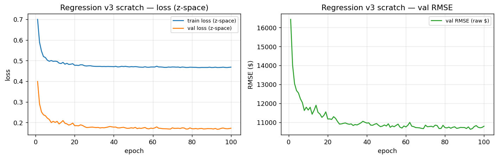

- **Why.** Torch R² 0.7673→0.7519 (−0.015), RMSE +3%; scratch R² 0.7429→0.7476 (+0.005, flat).
  Asymmetry vs classification: the 3/3 spend core carries ~98% of the signal (NumStorePurchases 0.530 /
  Kidhome −0.428 / MntFish 0.439 help at the margin but the deep net routes around them).
- **What next.** Keep the full 13-dim set — it costs nothing and is still best-by-oracle — but the practical
  lesson is the 8-dim 3/3 model is nearly as good and simpler to deploy. Next: novel models (v4).

## 4th Version (novel architectures — FT-Transformer-lite + NAM-robust)

- Two models from outside the taught list
- Nothing like Linear/Multiple/Polynomial, Logistic, Tree, RF, Stacking/GB/XGBoost, NB, SVM, kNN, kMeans, Perceptron/SLP, MLP
- LightGBM deliberately not submitted (GB-variant, not novel)
- TabPFN deliberately not submitted (pretrained, cannot be built from scratch)
- Each model has a PyTorch oracle and a from-scratch NumPy twin sharing one derivation lock
- 2,237-row cleaned data and 2,213-row dropped-target data
- Full 18-column / 13-column feature sets (the 2/3 tier stays after the v3 result)
- 80/20 splits and seed 42
- Adam(lr=1e-3, wd 1e-4) + cosine (T_max=100)
- 100 epochs
- Numeric grad-check before training in both twins
- clf grad-check on `tokW[0,0]` relerr 3.8e-9
- reg grad-check on `W2[0,0,0]` relerr 3.5e-12
- Best-checkpointing on each twin's own val stream
- clf checkpoint = best val-F1
- reg checkpoint = best val-RMSE

- `classification_pytorch_v4.ipynb`, `classification_scratch_v4.ipynb`
- `regression_pytorch_v4.ipynb`, `regression_scratch_v4.ipynb`
- `weights_v4/` (pt/npz/scaler/csv/json + `classification_pytorch_attn.json`,
  `regression_pytorch_shapes.json`, `regression_pytorch_outlier_diag.json`)
- `media/` — ONNX graphs (`arch_*.png`, rendered from the matching `arch_*.onnx`), loss curves, attention bars, NAM shapes for this report.
- `onnx_viz.py` — shared one-call helper (`save_graph`) every `_pytorch.ipynb` uses to export its graph (open any `media/*.onnx` in Netron to inspect).

### Classification

- **Architecture used.**
  - FT-Transformer-lite (torch `FTTransformerLite` + mirror NumPy twin)
  - `x(22) → 22×Linear(1→32) + CLS(32) → 2×[LN(32) → Q/K/V Linear(32→32)×3 → 4-head attention → Dropout(0.1) → Linear(32→32) → +resid → LN(32) → Linear(32→64) → ReLU → Dropout(0.1) → Linear(64→32) → +resid] → LN(32) → Linear(32→1)[CLS] → logit`

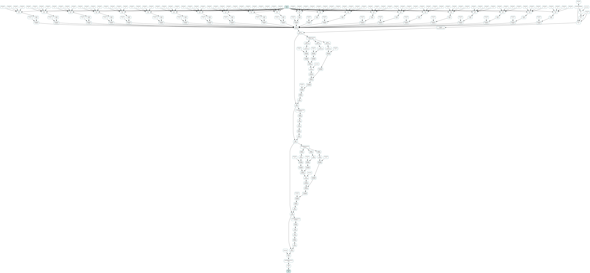

- **Training setup.**
  - 80/20 split
  - `random_state=42`
  - stratified on `Response`
  - `Income` NaNs median-filled as a *feature*
  - fill value = train median (51,735)
  - `StandardScaler` train-fit
  - batch 64
  - 100 epochs
  - weighted BCE (`pos_weight ≈ 5.7`)
  - Adam(lr=1e-3) + cosine annealing
  - weight decay 1e-4
  - no data augmentation

- **Results** (n_test=448, best-checkpoint each):

  | Metric | PyTorch | Scratch | absΔ |
  |---|---|---|---|
  | test BCE | 0.4214 | 0.4868 | 0.0654 |
  | accuracy | 0.8147 | 0.8460 | 0.0313 |
  | precision | 0.4310 | 0.4886 | 0.0576 |
  | recall | 0.7463 | 0.6418 | 0.1045 |
  | **F1** | **0.5464** | **0.5548** | **0.0084** |
  | ROC-AUC | 0.8501 | 0.8308 | 0.0193 |

  Curves: oracle train 0.978→0.277 / val 0.590→0.489, best-F1 0.5464 mid-training;
  scratch train 0.545→0.132 / val 0.539→0.487, best-F1 0.5548.

  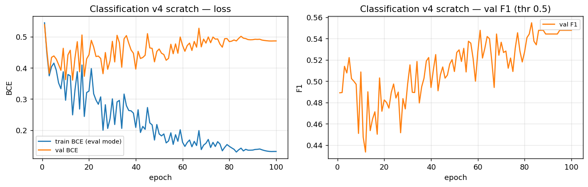

- **Why.** Oracle F1 0.5699→0.5464 (−0.024), ROC 0.8814→0.8501 — small-data attention overfits where
  the v2 ResNet block generalizes, consistent with literature (compact ResNet often beats transformers on
  small tabular). The value is elsewhere: the brief's novel-classification-model slot is filled with a full
  scratch derivation, and CLS-query attention mass independently rediscovers the EDA —
  `Recency` 0.118 / `Customer_Tenure_Days` 0.092 / `NumCatalogPurchases` 0.085 on top, the same RF #1/#2 ranks,
  not the bivariate ranking's `AcceptedCmp*` top.

  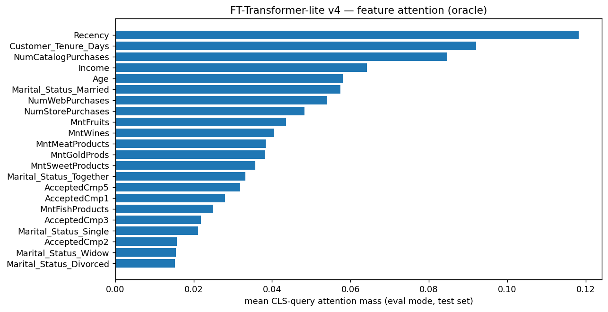

- **What next.** v2 stays the raw-score reference (F1 0.5699). The twin-agreement on F1 (Δ 0.0084) and ROC
  (Δ 0.0193) against different RNG streams and different stopping epochs shows equivalent implementations;
  the BCE gap (Δ 0.0654) is the checkpoint-epoch + attention-dropout-mask lottery both libraries admit.

### Regression

- **Architecture used.**
  - Neural Additive Model + log1p/Huber head (torch `NAM` + mirror NumPy twin)
  - `x(13) → 13×[Linear(1→64) → ReLU → Linear(64→1)] → Σ + b0 → ẑ → Huber(δ=0.5) → expm1 → $`

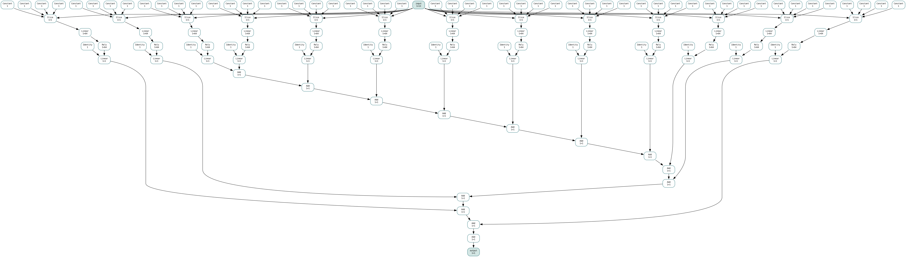

- **Training setup.**
  - 80/20 split
  - `random_state=42`
  - 24 missing-`Income` rows dropped
  - feature scaler train-fit
  - log1p target scaler train-fit
  - `log1p(Income)` then z-scored for training
  - every reported metric inverted via `expm1` to raw $
  - $666,666 outlier kept in training data
  - batch 64
  - 100 epochs
  - Huber(δ=0.5) loss
  - Adam(lr=1e-3) + cosine annealing
  - weight decay 1e-4
  - no data augmentation

- **Results** (n_test=443, raw $):

  | Metric | PyTorch | Scratch | absΔ / relΔ |
  |---|---|---|---|
  | test MSE | 127,856,870.8 | 128,681,375.2 | rel 0.006 |
  | **RMSE** | **11,307.4** | **11,343.8** | **rel 0.003** |
  | MAE | 7,031.9 | 7,055.5 | rel 0.003 |
  | **R²** | **0.7232** | **0.7214** | **0.0018** |

  Training: oracle train-huber 1.886→0.086 / val-RMSE $634,653 (epoch 1, $666k dominates $ space even
  through log) → $11,307; scratch 0.667→0.086 / $458,512 → $11,344.
  Tightest twin agreement of all four versions. Masked diagnostic (2 rows): RMSE $8,518 / R² 0.824.

  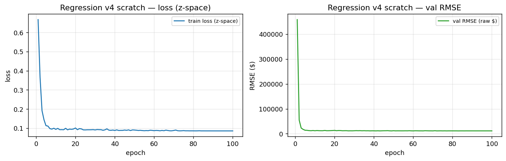

- **Why.** Oracle R² 0.7673→0.7232 (−0.044), RMSE $10,366→$11,307 (+9%). Additive models can't exploit
  the spend-cluster interactions the v2 trunk routes around — the expected glass-box price. The core fit is
  excellent (masked R² 0.824); the full-metric gap is the outlier price, paid transparently via Huber+log
  instead of hidden deletion.

  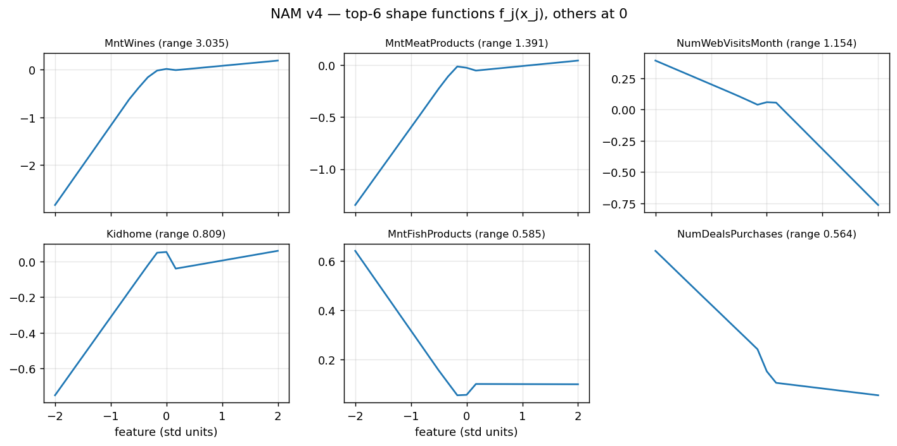

- **What next.** v2 stays the raw-score reference (R² 0.7673). Best oracle scores overall: clf v2 F1 0.5699,
  reg v2 R² 0.7673. Open ideas: LightGBM/TabPFN ceiling column for the slide deck; k-fold to tighten small-n noise.

## Version template (copy for v5, …)

### Classification — …
- Changed vs previous: … / Results vs previous best: … / Why + what next: …

### Regression — …
- Changed vs previous: … / Results vs previous best: … / Why + what next: …
